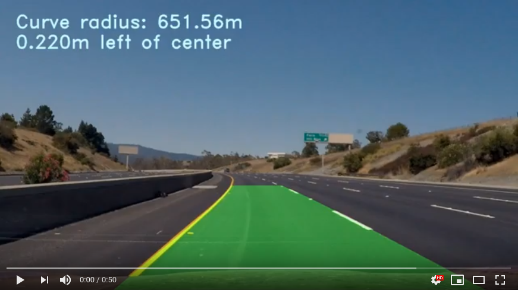
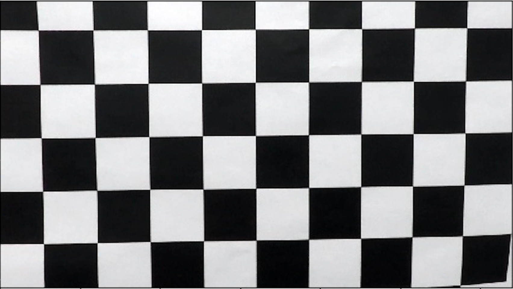
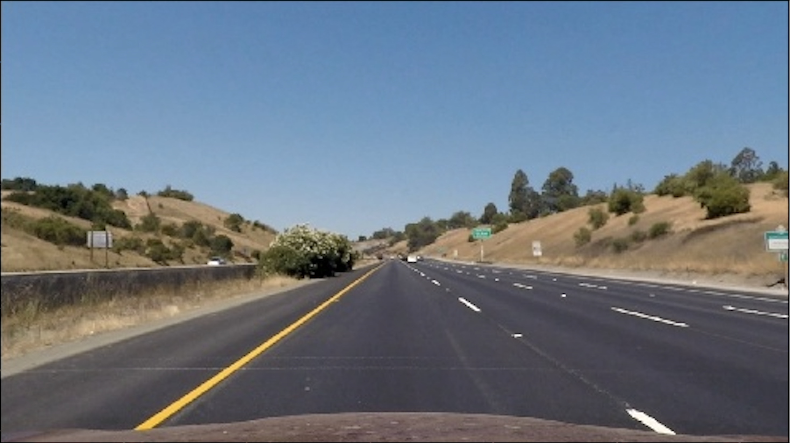
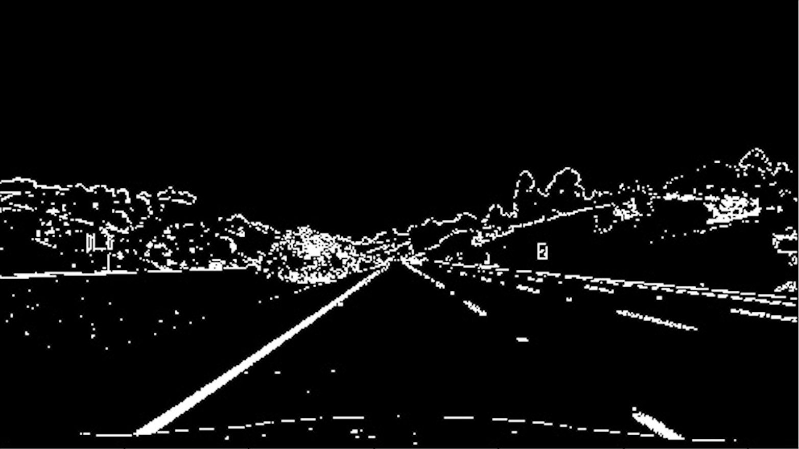
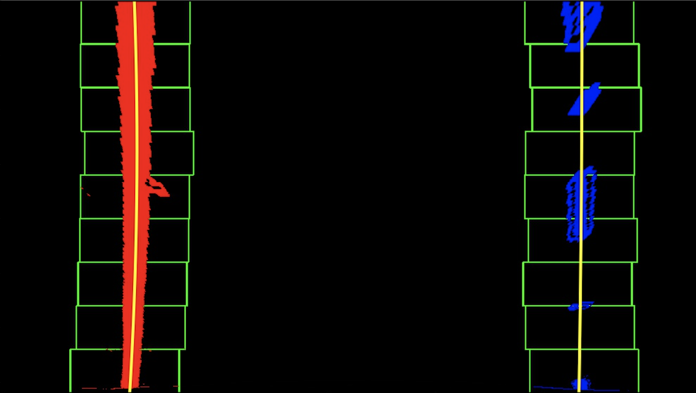
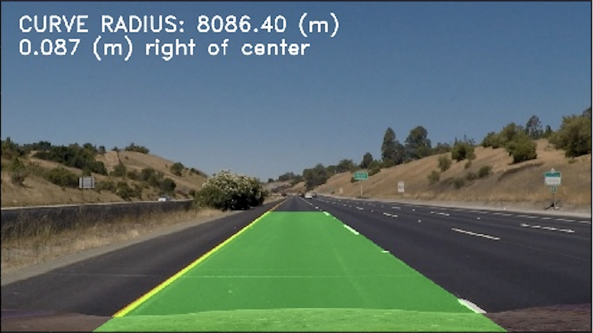

## Advanced Lane Finding

[](https://www.youtube.com/watch?v=g0TxAKaxdNk)

Goal: Find the lane lines and highlight the lane from a video.
---
Algorithm overview:

* Compute the camera calibration matrix and distortion coefficients given a set of chessboard images.
* Apply a distortion correction to raw images.
* Use color transforms, gradients, etc., to create a thresholded binary image.
* Apply a perspective transform to rectify binary image ("birds-eye view").
* Detect lane pixels and fit to find the lane boundary.
* Determine the curvature of the lane and vehicle position with respect to center.
* Warp the detected lane boundaries back onto the original image.
* Output visual display of the lane boundaries and numerical estimation of lane curvature and vehicle position.

Dependencies
---
This project was run with the following:

* [Python 3.6.8](https://www.python.org/downloads/) but 3.4+ should work.
* [Matplotlib 3.1.1](https://matplotlib.org/3.1.1/users/installing.html)
* [Numpy 1.17.1](https://docs.scipy.org/doc/numpy/user/install.html)
* [OpenCV 4.1.0](https://docs.opencv.org/).
* [IPython 7.7.0](https://ipython.org/install.html)
* [MoviePy 1.0.0](https://zulko.github.io/moviepy/install.html)

Files
---
1. **Calibration.py, get_calibration_factors.py, calibration.p**: Calibrations and get_calibration_factors are used in conjunction once to get the calibration factors that are stored in calibration.p and used in the rest of the program.
2. **box.py**: Used to run the algorithm on a single image at a time.
3. **videos.py**: Used to run the algorithm on a video.

How to run
---
Locally in your machine (Tested on Ubuntu 16.04 LTS):


Using Docker:
1. Install docker [Docker](https://docs.docker.com/install/)
2. Clone this repository: `https://github.com/martinezedwin/AdvancedLaneLines.git`
3. Go int othe repository: `cd AdvancedLaneLines`
4. Build the docker image: `sudo docker build . advancedlanelines`
5. Run the docker container: `sudo docker run --user=$(id -u) --env="DISPLAY" -p 4567:4567 -v $PWD:/AdcancedLaneLines -v /etc/group:/etc/group:ro -v/etc/passwd:/etc/passwd:ro -v /etc/sudoers.d:/etc/sudoers.d:ro -v /tmp/.X11-unix:/tmp/.X11-unix:rw --rm -it advancedlanelines`
6. 


Details
---
### Camera Calibration

Images of black and white checker boards from different angles where taken using the same camera used to take the lane video.

The code for this step is contained in lines #32 through #61 of the file called Calibration.py in conjuction with the get_calibration_factors.py.

I start by preparing "object points", which will be the (x, y, z) coordinates of the chessboard corners in the world. Here I am assuming the chessboard is fixed on the (x, y) plane at z=0, such that the object points are the same for each calibration image. Thus, objp is just a replicated array of coordinates, and objpoints will be appended with a copy of it every time I successfully detect all chessboard corners in a test image. imgpoints will be appended with the (x, y) pixel position of each of the corners in the image plane with each successful chessboard detection.

I then used the output objpoints and imgpoints to compute the camera calibration and distortion coefficients using the cv2.calibrateCamera() function. I applied this distortion correction to the test image using the cv2.undistort() function and obtained this result:


| Before                                                | After                                                                               |
|-------------------------------------------------------|-------------------------------------------------------------------------------------|
|    |  |


### Example of a distortion-corrected image.

We will be using test_images/straight_lines1.jpg as an example for the rest of this tutorial:

| Before                                                | After                                                                               |
|-------------------------------------------------------|-------------------------------------------------------------------------------------|
|      |                      |

### Color transform and gradients to highlight lane lines.

A combination of color transforms and gradients were tested to see which would bring out the lane lines the best in binary images. The L from [HLS color space](https://en.wikipedia.org/wiki/HSL_and_HSV) and B from [LAB color space where](https://en.wikipedia.org/wiki/CIELAB_color_space) used as shown in lines 51 thorugh 79 of box.py showed the best results.

In the end the output looked something like this:

| Before                                                | After                                                                               |
|-------------------------------------------------------|-------------------------------------------------------------------------------------|
|||


### Perspective transform.

In order to perform a perspective transform or "Birds-eye view" a trapezoid was defined by four vertices that correspond to coordinates on the image.

These verteceis became the src. The destination points or dst where also define using the shape of the image. By using the Unwarp.unwarp funciton that contains hte cv2.getPersepectiveTransform() and cv2.warpPerspective() in lines 94 through 121 of box.py a birds-eye view was obtained.

```
vertices = np.array([[(BR_h, BR_v), (BL_h,BL_v), (TL_h, TL_v), (TR_h, TR_v) ]], dtype=np.float32)

h, w = img.shape[:2]

src = vertices
dst = np.array([[w, h], [0, h], [0, 0], [w, 0]], dtype = np.float32)

warped = Unwarp.unwarp(color_combined, src, dst)
```

| Before                                                | After                                                                               |
|-------------------------------------------------------|-------------------------------------------------------------------------------------|
||  |


### Identified lane-line pixels and fit their positions with a polynomial.

In order to identify the pixels of a given binary image a historgram that shows high peaks where the lane lines are detected serves as a guide. 

For new undetected pixel images we start from the bottom of the image which would be closest to the car and form "windows" of specified size to continue seraching for lane lines along the image forward in the lane for each lane line.

For videos where we have already identified pixels in the previous frame, a focused search to where the prvious lane pixels where identified helps speed things up. This is shown in FindPix.py in find_lane_pils() and search_around_poly(). The pixels are then used to fit a polynomial by the fit_poly() functions.



### Calculated the radius of curvature of the lane and the position of the vehicle with respect to center.

Using the radius curviture equation seen here: https://www.intmath.com/applications-differentiation/8-radius-curvature.php
and the coefficients calculated by the np.polyfit() function in the fit_polynomial_cr(), the curvature for both lane lines was calculated. (FindPix.py lines 287 thorugh 307)


Assuming that the camera is placed in the center of the car and thus the center of the image, and calculating the center of the lane relative to the image, you can calculate how far off the car is from the center of the lane to the right or left. This is done in FIndPix.py in the get_offset() function.

### Example image of your result plotted back down onto the road such that the lane area is identified clearly.




---

### Discussion

#### Issues/Improvements

The hardest part for me was finding a good combination of RGB, HLS color spaces and gradients to make it robust. The pipeline relies on highlighting the correct pixels (lane lines) while leaving anything extra out. By using more examples of shadows, colors, etc. it could be made more robust to be able to detect different types of lane lines under many different conditions.

